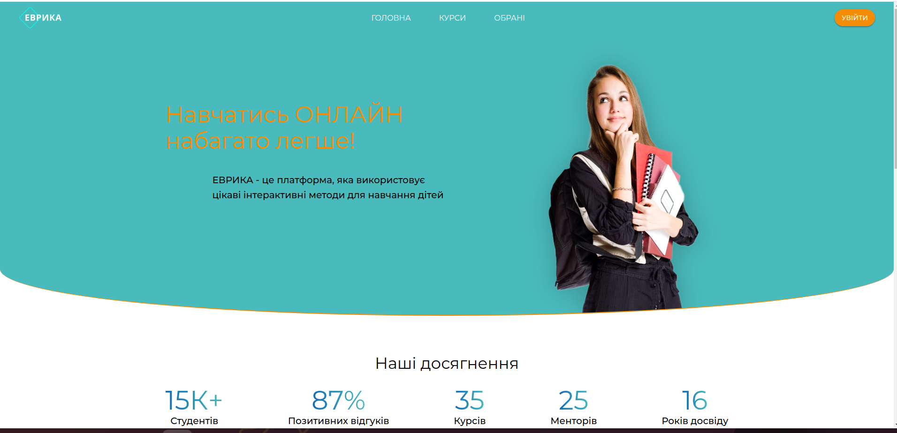
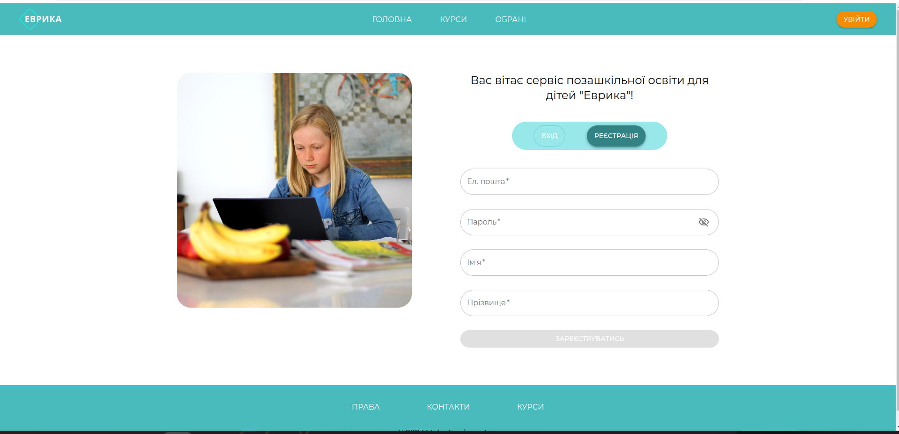

# Evrika

#### Courses for children's education. Where parents can choose the best course for their child and purchase it in their account 


# Check it out!
[Evrika project deployed to Render](https://evryka-app.onrender.com/)


## Features

* Django REST api also deployed [DRF API - Evrika on render](https://evryka-app.onrender.com/)
* JWT user authentication by email & password
* Powerful admin panel for advanced managing
* Order counting sum total cost for list of courses price
* Filtering by age of pupils
* Filtering by duration of course
* Filtering by type of subject
* Create user at api/user/register/
* Login and accesses user token at /api/user/token/
* List of courses at /api/catalog/courses/
* Detail courses at /api/catalog/courses/{pk}
* Order create at /api/catalog/orders/
* Mail notification to create user & order receipt
* Documentation by Swagger & Redoc


## Demo




## Installation
Python3 and Django REST framework must be already installed

```shell
git clone https://github.com/MarynaProkhorenko/Evrika
cd backend
python3 -m venv venv
source venv/bin/activate
pip install -r requirements.txt
python manage.py makemigrations
python manage.py migrate
python mnange.py runserver
```